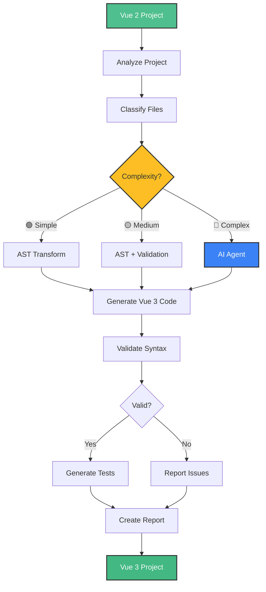
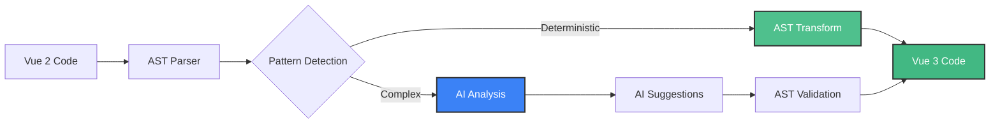

<div align="center">

# vue-ai-migrator

**The most comprehensive and performant Vue 2 → Vue 3 migration tool**  
_AST-based transformations + AI integration for reliable migrations_

[](https://www.npmjs.com/package/vue-ai-migrator)
[](https://www.npmjs.com/package/vue-ai-migrator)
[](LICENSE)
[](https://github.com/TylerDurden75/vue-ai-migrator)
[](https://github.com/TylerDurden75/vue-ai-migrator/actions)
[](https://codecov.io/gh/TylerDurden75/vue-ai-migrator)
[](https://www.typescriptlang.org/)
[](https://nodejs.org/)

[Documentation](./USAGE.md) • [Examples](./EXAMPLES.md) • [API Keys](./API_KEYS.md) • [Changelog](./CHANGELOG.md)

</div>

> 🎯 **Vision**: Build a migration tool that is **assisted, reliable, explainable and secure**, not a magic one-click migration.

Automatic Vue 2 → Vue 3 migration combining:

- **AST Analysis** for deterministic transformations
- **Migration Rules** for Vue 2 → Vue 3 patterns
- **AI Agent** (LLM) for complex cases requiring intelligent assistance

> 📖 **Not a developer?** 👉 Check out the **[Simple Guide (GUIDE_SIMPLE.md)](GUIDE_SIMPLE.md)** - Simple explanation without technical jargon, with concrete examples.

## 📑 Table of Contents

- [Features](#-features)
- [Installation](#-installation)
- [Quick Start](#-quick-start)
- [Usage](#-usage)
- [Configuration](#-configuration)
- [Supported Transformations](#-supported-transformations)
- [AI Integration](#-ai-integration)
- [Performance](#-performance)
- [Safety & Rollback](#-safety--rollback)
- [Testing](#-testing)
- [Roadmap](#-roadmap)
- [Documentation](#-documentation)
- [Contributing](#-contributing)
- [Troubleshooting](#-troubleshooting)
- [License](#-license)

## 🚀 Features

- **Automatic codemods**: Comprehensive transformations from Vue 2 to Vue 3
- **AI for complex cases**: Use AI for difficult migrations with retry logic
- **Vue SFC support**: Full parsing and transformation of `.vue` files (template, script, style)
- **Template transformations**: Slots, scoped slots, filters, v-model in templates
- **Code analysis**: Automatic detection of Vue 2 patterns
- **Progressive migration**: Support for step-by-step migrations
- **Rollback system**: Automatic backups with easy rollback capability
- **Detailed reports**: Statistics and post-migration suggestions
- **Parallel processing**: Process multiple files simultaneously for better performance
- **Smart caching**: Avoids reprocessing unchanged files
- **Robust error handling**: Comprehensive error handling with retry mechanisms
- **Well tested**: 109+ unit tests covering all modules and transformations
- **Classification system**: Automatic complexity classification (Simple/Medium/Complex)
- **Test generation**: Automatic Vitest test generation for migrated components
- **Enhanced reporting**: Detailed reports with classification and recommendations
- **TypeScript support**: Automatic TypeScript type annotations with `--typescript` flag
  - Typed props with interfaces for complex cases
  - Typed refs, computed, and reactive values
  - Typed function parameters and return types
  - Intelligent type inference from Vue 2 code
  - See [TypeScript Support](#typescript-support) section for detailed examples

## 🏗️ Architecture

### Migration Workflow



### Hybrid Approach: AST + AI



## 📖 Documentation

- **[Simple Guide (GUIDE_SIMPLE.md)](GUIDE_SIMPLE.md)** - For non-developers, simple language explanation
- **[README.md](README.md)** - Complete documentation for developers (you are here)
- **[COVERAGE_ANALYSIS.md](COVERAGE_ANALYSIS.md)** - Coverage analysis of Vue 3 breaking changes

## 📦 Installation

### Requirements

- Node.js >= 16.0.0
- npm or yarn
- (Optional) OpenAI API key for AI features

### Install

**Global installation** (recommended for CLI usage):

```bash
npm install -g vue-ai-migrator
```

**Local installation** (for programmatic usage):

```bash
npm install vue-ai-migrator --save-dev
```

## 🚀 Quick Start

### 📸 CLI in Action

<details>
<summary>View CLI output examples</summary>

#### Analyze with Classification

```
$ vue-ai-migrator analyze ./my-project --classify

✔ Analyzing project...
✔ Classification completed!

📋 File Classification:
  🟢 Simple: 1
  🟡 Medium: 0
  🔴 Complex: 1

  Sample classifications:
    🟢 App.vue: simple
    🔴 HelloWorld.vue: complex
      Reasons: Filters in template
```

#### Migrate (Dry-run)

```
$ vue-ai-migrator migrate ./my-project --dry-run --no-ai

✔ Migration completed!

✓ Migration results:
  - Files analyzed: 2
  - Files modified: 1
  - Transformations applied: 2

  Classification:
    🟢 Simple: 1
    🟡 Medium: 0
    🔴 Complex: 1
```

</details>

> **📸 Screenshots**: See [SCREENSHOTS_GUIDE.md](./SCREENSHOTS_GUIDE.md) for creating visual screenshots

1. **Analyze your Vue 2 project**:

```bash
vue-ai-migrator analyze ./my-vue2-project
```

2. **Run migration in dry-run mode** (test without modifying files):

```bash
export OPENAI_API_KEY=sk-your-api-key-here
vue-ai-migrator migrate ./my-vue2-project --dry-run --show-diff
```

3. **Run actual migration**:

```bash
vue-ai-migrator migrate ./my-vue2-project
```

### 🔄 Complete Migration

vue-ai-migrator automatically migrates **ALL** of your Vue 2 project to Vue 3:

- ✅ **Vue Components** (`.vue` files)
- ✅ **Vuex → Pinia Stores** (files with `new Vuex.Store()`)
- ✅ **Router** (Vue Router 3 → Vue Router 4)
- ✅ **Plugins, Mixins, Directives**
- ✅ **All JS/TS files** in the project

**Example: Migrate only stores**

```bash
vue-ai-migrator migrate ./src/store --transformations "vuex-pinia"
```

### Before & After Example

**Vue 2 (Before):**

```vue
<template>
  <div>{{ message | capitalize }}</div>
</template>

<script>
export default {
  data() {
    return {
      message: 'hello vue',
    };
  },
  filters: {
    capitalize(value) {
      return value.toUpperCase();
    },
  },
};
</script>
```

**Vue 3 (After):**

```vue
<template>
  <div>{{ capitalize(message) }}</div>
</template>

<script setup lang="ts">
import { ref } from 'vue';

const message = ref('hello vue');

function capitalize(value: string) {
  return value.toUpperCase();
}
</script>
```

## 🎯 Usage

### CLI Commands

vue-ai-migrator provides several commands:

#### `analyze` - Analyze Project

Analyze a Vue 2 project to detect migration needs:

```bash
vue-ai-migrator analyze <project-path> [options]
```

**Options:**

- `--classify`: Classify files by migration complexity (Simple/Medium/Complex)
- `--output <file>`: Save analysis report to file

**Example:**

```bash
vue-ai-migrator analyze ./my-project --classify
```

#### `migrate` - Migrate Project

Migrate a Vue 2 project to Vue 3:

```bash
vue-ai-migrator migrate <project-path> [options]
```

**Options:**

- `-k, --ai-api-key <key>`: API key for AI (or use environment variable)
- `-p, --provider <provider>`: AI provider (openai, mistral, claude, anthropic) - default: openai
- `-d, --dry-run`: Test migration without modifying files
- `--show-diff`: Show detailed diff for each file in dry-run mode
- `--generate-tests`: Automatically generate Vitest tests for migrated components
- `--no-ai`: Disable AI usage
- `--transformations <list>`: Comma-separated list of transformations to apply
- `--no-rollback`: Disable automatic backups
- `-o, --output <file>`: Output file for migration report
- `--typescript`: Enable TypeScript type annotations in migrated code (see [TypeScript Support](#typescript-support))

**Examples:**

```bash
# Dry-run with diff
vue-ai-migrator migrate ./my-project --dry-run --show-diff

# Full migration with AI
export OPENAI_API_KEY=sk-your-key
vue-ai-migrator migrate ./my-project --generate-tests

# Migration without AI
vue-ai-migrator migrate ./my-project --no-ai

# Migration with TypeScript types (generates <script setup lang="ts">)
vue-ai-migrator migrate ./my-project --typescript

# Migrate only Vuex stores to Pinia
vue-ai-migrator migrate ./src/store --transformations "vuex-pinia"

# Migrate with specific transformations
vue-ai-migrator migrate ./src --transformations "async-components,render-functions"

# Explicitly generate <script setup lang="ts">
vue-ai-migrator migrate ./my-project --transformations "script-setup" --typescript
```

> 💡 **Note**: With `--typescript`, the migrated code automatically generates `<script setup lang="ts">` if the code is transformed to Composition API. See [EXPLICATION_SCRIPT_SETUP.md](EXPLICATION_SCRIPT_SETUP.md) for more details.

**Output:**

```
✔ Migration completed!

✓ Migration results:
  - Files analyzed: 2
  - Files modified: 1
  - Transformations applied: 2
```

#### `plan` - Generate Migration Plan

Generate a prioritized migration plan with AI assistance:

```bash
vue-ai-migrator plan <project-path> [options]
```

**Options:**

- `-k, --ai-api-key <key>`: API key for AI
- `-p, --provider <provider>`: AI provider - default: openai
- `-o, --output <file>`: Output file for the plan - default: migration-plan.json

**Example:**

```bash
export OPENAI_API_KEY=sk-your-key
vue-ai-migrator plan ./my-project --output migration-plan.json
```

#### `report` - View Migration Report

View or export a migration report:

```bash
vue-ai-migrator report <report-file> [options]
```

**Options:**

- `-f, --format <format>`: Output format (json, markdown, console) - default: console
- `-o, --output <file>`: Output file (for json/markdown formats)

**Example:**

```bash
vue-ai-migrator report migration-report.json --format markdown --output report.md
```

#### `rollback` - Rollback Migration

Rollback a migration (restore files from backup):

```bash
vue-ai-migrator rollback <project-path> [options]
```

**Options:**

- `-a, --all`: Rollback all files
- `-f, --file <file>`: Rollback a specific file

**Examples:**

```bash
# Rollback all files
vue-ai-migrator rollback ./my-project

# Rollback specific file
vue-ai-migrator rollback ./my-project --file src/components/MyComponent.vue
```

### Programmatic API

```typescript
import { migrate, UnifiedAIService } from 'vue-ai-migrator';

// Basic usage with environment variable
await migrate({
  projectPath: './my-project',
  aiApiKey: process.env.OPENAI_API_KEY,
  aiProvider: 'openai',
  dryRun: false,
  enableTypeScript: true, // Enable TypeScript type annotations
});

// Advanced usage with custom AI service
const aiService = new UnifiedAIService({
  provider: 'openai',
  apiKey: process.env.OPENAI_API_KEY || 'sk-your-key',
  model: 'gpt-4-turbo-preview',
  temperature: 0.3,
});
```

## 🔧 Configuration

### API Keys Setup

**Recommended**: Use environment variables for API keys:

```bash
# OpenAI
export OPENAI_API_KEY=sk-your-api-key-here

# Mistral (coming soon)
export MISTRAL_API_KEY=your-mistral-key

# Anthropic/Claude (coming soon)
export ANTHROPIC_API_KEY=sk-ant-your-key
```

See [API_KEYS.md](./API_KEYS.md) for detailed configuration guide.

### Configuration File

Create a `vue-migrator.config.js` file at the root of your project:

```javascript
module.exports = {
  // Paths to ignore
  ignore: ['node_modules', 'dist'],

  // Use AI for complex cases
  useAI: true,

  // AI Configuration
  ai: {
    provider: 'openai', // 'openai' | 'mistral' | 'claude' | 'anthropic'
    apiKey: process.env.OPENAI_API_KEY,
    model: 'gpt-4-turbo-preview', // Optional
    temperature: 0.3, // Optional
  },

  // Transformations to apply
  transformations: ['composition-api', 'global-api', 'router', 'vuex-pinia'],
};
```

## 📋 Supported Transformations

### Script Transformations

- ✅ **Options API → Composition API**: Complete transformation using AST manipulation
  - `data()` → `ref()`/`reactive()`
  - `computed` → `computed()`
  - `methods` → functions
  - `props` → `defineProps()`
  - `emits` → `defineEmits()`
  - `watch` → `watch()`
  - Lifecycle hooks → `onMounted()`, `onUpdated()`, etc.
  - `$listeners` → `$attrs`
- ✅ **Script Setup Conversion**: Automatic conversion to `<script setup lang="ts">` format
- ✅ **Global API changes**: `new Vue()` → `createApp()`, Vue.component() → app.component()
- ✅ **Router Vue 2 → Vue Router 4**: `new Router()` → `createRouter()`, mode → history functions
- ✅ **Vuex → Pinia**: Complete store transformation using Setup Store syntax
  - `new Vuex.Store()` → `defineStore('name', () => { ... })`
  - `state` → `ref()`/`reactive()` declarations
  - `getters` → `computed()` declarations
  - `mutations` → functions (direct state mutation)
  - `actions` → functions
  - Automatic import updates (`vuex` → `pinia`)
  - See [Vuex → Pinia Example](#vuex--pinia-migration) below
- ✅ **Filters removal**: Automatic filter detection and removal from script
- ✅ **Event API changes**: `$on`/`$off`/`$once` detection and marking for AI
- ✅ **v-model changes**: Props/emits transformation (value → modelValue, input → update:modelValue)
- ✅ **Mixins**: Detection and transformation of mixins
- ✅ **Plugins**: Vue.use() → app.use() transformation
- ✅ **Directives**: Custom directive hooks transformation (bind → beforeMount, etc.)
- ✅ **Provide/Inject**: Detection and suggestions for Vue 3 improvements
- ✅ **Async Components**: `() => import('./Comp.vue')` → `defineAsyncComponent(() => import('./Comp.vue'))`
  - Handles both arrow functions and object component definitions
- ✅ **Render Functions**: `render(h)` → `render()` with `import { h } from 'vue'` and `resolveComponent()` for registered components
  - Removes `h` parameter from render functions
  - Transforms `h('ComponentName')` → `h(resolveComponent('ComponentName'))`
  - Automatically adds `h` import when used

### Template Transformations

- ✅ **Scoped slots**: `slot-scope` → `v-slot` syntax
- ✅ **Named slots**: `slot="name"` → `v-slot:name`
- ✅ **Filters in templates**: `{{ value | filter }}` → `{{ filter(value) }}`
- ✅ **$listeners**: `$listeners` → `$attrs` in templates
- ✅ **Functional components**: Removal of `functional` attribute
- ✅ **v-for template key**: Moves `key` from inner element to `<template>` in `v-for`
  - Example: `<template v-for="..."><div :key="id">` → `<template v-for="..." :key="id"><div>`
- ✅ **v-else-if key**: Automatically adds `key` to `v-else-if` when `v-if` has one
- ✅ **v-for/v-if precedence**: Wraps elements with both `v-for` and `v-if` in `<template>`
  - Example: `<div v-for="..." v-if="...">` → `<template v-for="..."><div v-if="...">`
- ✅ **transition-group root**: Ensures `<transition-group>` has single root element
  - Example: `<transition-group><div></div><div></div>` → `<transition-group><div><div></div><div></div></div>`

### File Support

- ✅ **Vue SFC**: Full `.vue` file parsing (template, script, style sections)
- ✅ **JavaScript/TypeScript**: `.js`, `.ts`, `.jsx`, `.tsx` files

## 📘 TypeScript Support

The `--typescript` flag enables automatic TypeScript type annotations in migrated code, **including components and stores**.

### Features

- ✅ **Typed refs**: `const count = ref<number>(0)` (in components and stores)
- ✅ **Typed computed**: `const double = computed<number>(() => count.value * 2)` (in components and stores)
- ✅ **Typed props**: Generates interfaces for complex props
- ✅ **Typed functions**: Function parameters and return types (in components, mutations, and actions)
- ✅ **Intelligent type inference**: Infers types from Vue 2 code patterns
- ✅ **Script setup conversion**: Automatically converts to `<script setup lang="ts">`
- ✅ **Store types**: Pinia stores get TypeScript types for state properties, getters, mutations, and actions

### Example

**Before (Vue 2):**

```vue
<script>
export default {
  props: {
    count: Number,
    message: String,
  },
  data() {
    return {
      items: [],
    };
  },
  computed: {
    total() {
      return this.items.length;
    },
  },
  methods: {
    addItem(item) {
      this.items.push(item);
    },
  },
};
</script>
```

**After (Vue 3 with `--typescript`):**

```vue
<script setup lang="ts">
import { ref, computed } from 'vue';

interface Props {
  count: number;
  message: string;
}

const props = defineProps<Props>();

const items = ref<unknown[]>([]);

const total = computed<number>(() => items.value.length);

function addItem(item: unknown): void {
  items.value.push(item);
}
</script>
```

### Usage

```bash
# Enable TypeScript types in migration
vue-ai-migrator migrate ./my-project --typescript

# With programmatic API
import { migrate } from 'vue-ai-migrator';

await migrate({
  projectPath: './my-project',
  enableTypeScript: true,
});
```

## 🔄 Vuex → Pinia Migration

vue-ai-migrator automatically migrates Vuex stores to Pinia Setup Stores.

### Example

**Before (Vuex):**

```javascript
import Vue from 'vue';
import Vuex from 'vuex';

Vue.use(Vuex);

export default new Vuex.Store({
  state: {
    count: 0,
    user: {
      name: 'John',
      email: 'john@example.com',
    },
  },
  getters: {
    doubleCount: (state) => state.count * 2,
    userName: (state) => state.user.name,
  },
  mutations: {
    INCREMENT(state) {
      state.count++;
    },
    SET_USER(state, user) {
      state.user = user;
    },
  },
  actions: {
    increment({ commit }) {
      commit('INCREMENT');
    },
    async fetchUser({ commit }, userId) {
      const user = await api.getUser(userId);
      commit('SET_USER', user);
      return user;
    },
  },
});
```

**After (Pinia Setup Store):**

```typescript
import { defineStore } from 'pinia';
import { ref, computed } from 'vue';

export const useStore = defineStore('store', () => {
  // State
  const count = ref(0);
  const user = ref({
    name: 'John',
    email: 'john@example.com',
  });

  // Getters
  const doubleCount = computed(() => count.value * 2);
  const userName = computed(() => user.value.name);

  // Mutations (now functions)
  function INCREMENT() {
    count.value++;
  }

  function SET_USER(newUser: typeof user.value) {
    user.value = newUser;
  }

  // Actions
  function increment() {
    INCREMENT();
  }

  async function fetchUser(userId: string) {
    const fetchedUser = await api.getUser(userId);
    SET_USER(fetchedUser);
    return fetchedUser;
  }

  return {
    count,
    user,
    doubleCount,
    userName,
    increment,
    fetchUser,
  };
});
```

### Migration Command

```bash
# Migrate all Vuex stores in the project
vue-ai-migrator migrate ./my-project --transformations "vuex-pinia"

# Migrate only stores directory
vue-ai-migrator migrate ./src/store --transformations "vuex-pinia"

# With TypeScript types
vue-ai-migrator migrate ./src/store --transformations "vuex-pinia" --typescript
```

**Note:** The `--typescript` flag works for both components and stores. When migrating stores with `--typescript`, you'll get:

- Typed refs: `const count = ref<number>(0)`
- Typed computed: `const doubleCount = computed<number>(() => count.value * 2)`
- Typed functions: `function INCREMENT(): void { ... }`
- Typed parameters: `function SET_MESSAGE(message: string): void { ... }`

````

## 🤖 AI Integration

For complex cases that codemods cannot handle automatically, vue-ai-migrator uses AI to:

- Analyze code context
- Propose intelligent refactorings
- Generate equivalent Vue 3 code
- Detect custom patterns
- Classify migration complexity
- Generate tests for migrated code
- Explain migration changes

**Features:**

- **Multi-provider support**: OpenAI, Mistral, Claude (extensible)
- **Advanced AI Agent**: Intelligent migration assistance with explanation and test generation
- **Classification**: Automatic complexity analysis (Simple/Medium/Complex)
- Automatic retry with exponential backoff (2-3 attempts)
- Input validation and size limits
- API key validation

## ⚡ Performance

vue-ai-migrator is **highly performant** compared to competitors:

- **Parallel processing**: Files are processed in batches (10-20 files) for optimal performance
- **~10x faster** than sequential tools, **~60x faster** with caching (incremental mode)
- **Vue SFC parsing**: Efficient parsing of `.vue` files with separate template/script/style processing
- **Smart caching**: SHA256 hash-based cache with persistent storage avoids reprocessing unchanged files
- **Incremental mode**: Process only changed files for faster subsequent migrations
- **Dynamic batch sizing**: Automatically adjusts batch size based on project size (10-20 files/batch)
- **AST-based transformations**: Direct AST manipulation (no string operations) for better performance
- **Early validation**: Validates before processing to avoid unnecessary work
- **Zero runtime overhead**: Unlike compatibility layers, generates native Vue 3 code

**Performance Benchmarks:**

- Small projects (< 50 files): < 5 seconds
- Medium projects (50-200 files): 5-30 seconds
- Large projects (200-1000 files): 30-120 seconds (first run), < 10 seconds (incremental)
- Very large projects (1000+ files): 2-5 minutes (first run), < 30 seconds (incremental)

### Performance Comparison

```mermaid
graph LR
    A[Sequential Processing] -->|~100s| B[100 files]
    C[Parallel Processing] -->|~10s| B
    D[With Cache] -->|~1.5s| B

    style A fill:#EF4444,stroke:#333,stroke-width:2px,color:#fff
    style C fill:#F59E0B,stroke:#333,stroke-width:2px,color:#fff
    style D fill:#10B981,stroke:#333,stroke-width:2px,color:#fff
````

See [PERFORMANCE.md](./PERFORMANCE.md) for detailed performance analysis and comparison with competitors.

## 🛡️ Safety & Rollback

### Safety Features

- **Automatic backups**: All modified files are backed up before changes
- **Dry-run mode**: Test migrations without modifying files (with diff visualization)
- **Post-migration validation**: Automatic validation of migrated code
- **Rollback system**: Easy rollback with `vue-ai-migrator rollback` command

### Validation

- ✅ **Syntax validation**: Post-migration syntax checking
- ✅ **AST validation**: Ensures generated code is valid
- ✅ **Type checking**: TypeScript validation (when applicable)

### Hallucination Management

- ✅ **Strict rules**: Official Vue 3 migration guide rules enforced
- ✅ **AST validation**: All AI-generated code validated against AST
- ✅ **No execution**: Generated code never executed without validation

### Security

- ✅ **No code execution**: Generated code validated but not executed
- ✅ **Path validation**: Protection against path traversal
- ✅ **Input validation**: Size limits and format checking

### Explicability

- ✅ **Diff visualization**: Clear before/after comparison
- ✅ **Change justification**: AI explains why changes were made
- ✅ **Migration reports**: Comprehensive reports with statistics and suggestions

### Rollback

If something goes wrong, you can rollback the migration:

```bash
# Rollback all files
vue-ai-migrator rollback ./my-vue2-project

# Rollback a specific file
vue-ai-migrator rollback ./my-vue2-project --file src/components/MyComponent.vue
```

## 🧪 Testing

- **109+ unit tests** covering all modules and transformations
- **100% pass rate** - All tests passing
- **AST-based transformations** for robust code generation
- Tests for error handling, transformations, and migration flow
- Comprehensive tests for:
  - Composition API and Script Setup transformations
  - Template transformations (v-for, v-if, slots, transitions)
  - Async components and render functions
  - Vuex → Pinia migration
  - TypeScript type inference

## 📚 Documentation

- **[Usage Guide](./USAGE.md)**: Complete usage instructions and examples
- **[Examples](./EXAMPLES.md)**: Real-world migration examples
- **[API Keys Configuration](./API_KEYS.md)**: How to configure AI provider API keys
- **[Roadmap](./ROADMAP.md)**: Future development plans
- **[Changelog](./CHANGELOG.md)**: Version history and changes

## 🗺️ Roadmap

See [ROADMAP.md](./ROADMAP.md) for detailed roadmap and future plans.

**Current Version**: v0.5.0 - MVP Complete

- ✅ Core migration features
- ✅ AI Agent integration
- ✅ Classification system
- ✅ Test generation
- ✅ Migration planning

**Next Version**: v0.6.0 - Core Improvements

- 🔄 Enhanced Composition API transformations
- 🔄 Performance optimizations
- 🔄 More test coverage

## 🤝 Contributing

Contributions are welcome! We appreciate your help in making vue-ai-migrator better.

### How to Contribute

1. **Fork the repository**
2. **Create a feature branch**: `git checkout -b feature/amazing-feature`
3. **Make your changes** and add tests
4. **Run tests**: `npm test`
5. **Commit your changes**: `git commit -m 'Add amazing feature'`
6. **Push to the branch**: `git push origin feature/amazing-feature`
7. **Open a Pull Request**

### Current Priorities

1. Improve Composition API transformations
2. Add more test cases
3. Document complex use cases
4. Optimize performance
5. Add support for Mistral and Claude APIs

### Development Setup

```bash
# Clone the repository
git clone https://github.com/TylerDurden75/vue-ai-migrator.git
cd vue-ai-migrator

# Install dependencies
npm install

# Build the project
npm run build

# Run tests
npm test

# Run in watch mode
npm run dev
```

## 🔧 Troubleshooting

### Common Issues

#### "AI API key required"

**Solution**: Set the `OPENAI_API_KEY` environment variable or use `--ai-api-key` option. See [API_KEYS.md](./API_KEYS.md) for detailed configuration.

#### "Invalid OpenAI API key format"

**Solution**: Ensure your key starts with `sk-` and is the correct length. Check [API_KEYS.md](./API_KEYS.md) for validation details.

#### "No Vue files found in the project"

**Solution**: Ensure you're running the command from the correct directory and that your project contains `.vue` files.

#### "Provider not yet implemented"

**Solution**: Currently only OpenAI is fully supported. Mistral and Claude support is coming in v0.7.0. Use `--provider openai` or omit the provider option.

#### Migration fails on specific files

**Solution**:

1. Check the migration report for details
2. Use `--dry-run` mode to preview changes
3. Try migrating without AI first: `--no-ai`
4. Check if the file needs manual intervention (marked as Complex)

#### Rollback not working

**Solution**: Ensure backups exist. Check `.vue-migrator-backup/` directory in your project root.

### Getting Help

- **GitHub Issues**: [Report a bug or request a feature](https://github.com/TylerDurden75/vue-ai-migrator/issues)
- **Documentation**: Check [USAGE.md](./USAGE.md) and [EXAMPLES.md](./EXAMPLES.md)
- **API Keys**: See [API_KEYS.md](./API_KEYS.md) for configuration help

## 📝 License

MIT

## 🙏 Acknowledgments

Built with ❤️ by the Vue community. Special thanks to:

- Vue.js team for the excellent migration guide
- jscodeshift for AST transformations
- OpenAI for AI capabilities
