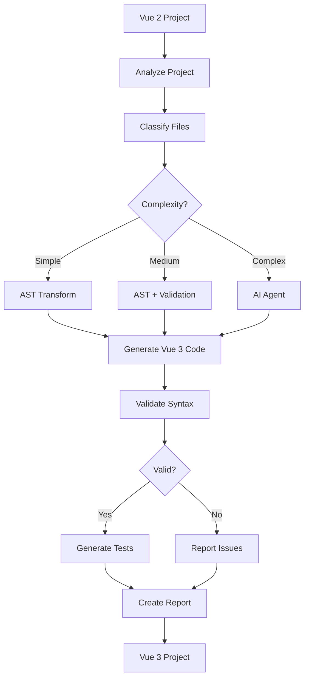
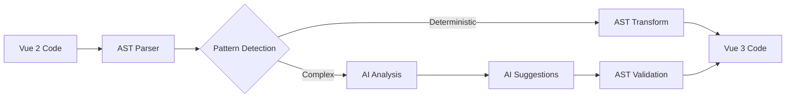

# Migration Architecture

## Workflow

```
Vue 2 Project
    ↓
[Analyze Project]
    ↓
[Classify Files]
    ↓
{Complexity Assessment}
    ├─→ 🟢 Simple → [AST Transform]
    ├─→ 🟡 Medium → [AST + Validation]
    └─→ 🔴 Complex → [AI Agent]
    ↓
[Generate Vue 3 Code]
    ↓
[Validate Syntax]
    ↓
{Valid?}
    ├─→ Yes → [Generate Tests] → [Create Report]
    └─→ No → [Report Issues] → [Create Report]
    ↓
Vue 3 Project
```

**Steps:**

1. **Analyze Project**: Scans all Vue files and detects patterns
2. **Classify Files**: Categorizes files by complexity (Simple/Medium/Complex)
3. **Transform**:
   - 🟢 **Simple**: Direct AST transformation (fast, deterministic)
   - 🟡 **Medium**: AST transformation with validation
   - 🔴 **Complex**: AI-assisted transformation with retry logic
4. **Generate Vue 3 Code**: Produces migrated code
5. **Validate Syntax**: Ensures generated code is valid
6. **Generate Tests** (optional): Creates Vitest tests for migrated components
7. **Create Report**: Generates detailed migration report

## Hybrid Approach: AST + AI

```
Vue 2 Code
    ↓
[AST Parser]
    ↓
{Pattern Detection}
    ├─→ Deterministic → [AST Transform] → Vue 3 Code
    └─→ Complex → [AI Analysis] → [AI Suggestions] → [AST Validation] → Vue 3 Code
```

**Strategy:**

- **Deterministic patterns** (90% of cases): Fast AST-based transformation
- **Complex patterns** (10% of cases): AI analysis with AST validation for reliability

## Mermaid Diagrams

<details>
<summary>View Migration Workflow diagram</summary>



</details>

<details>
<summary>View Hybrid AST + AI diagram</summary>



</details>
